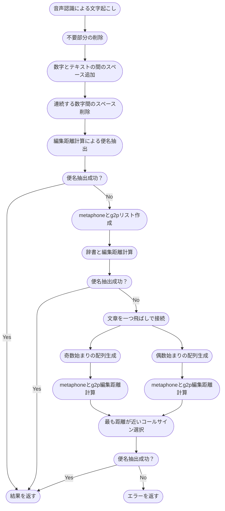
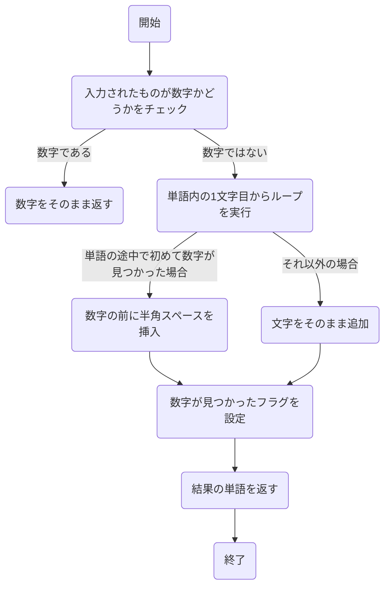
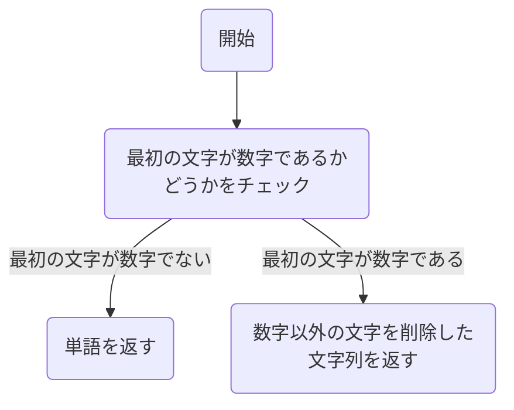
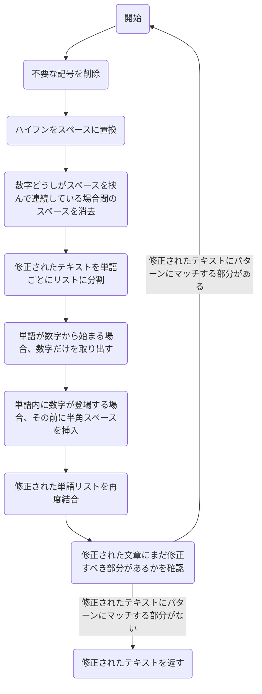
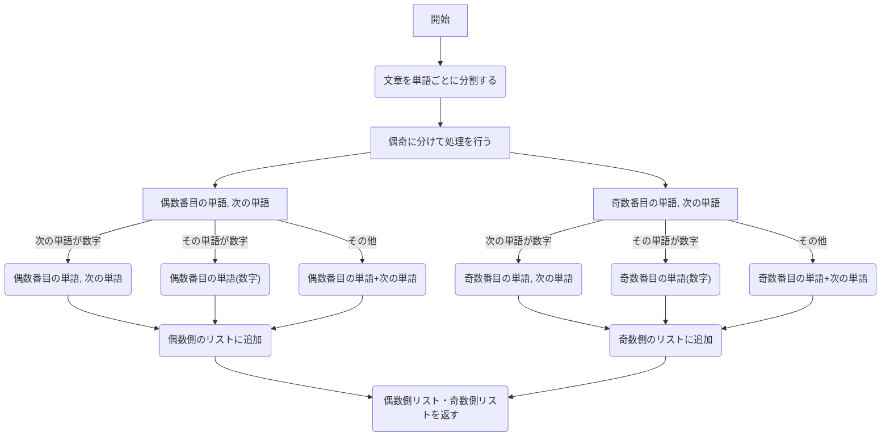
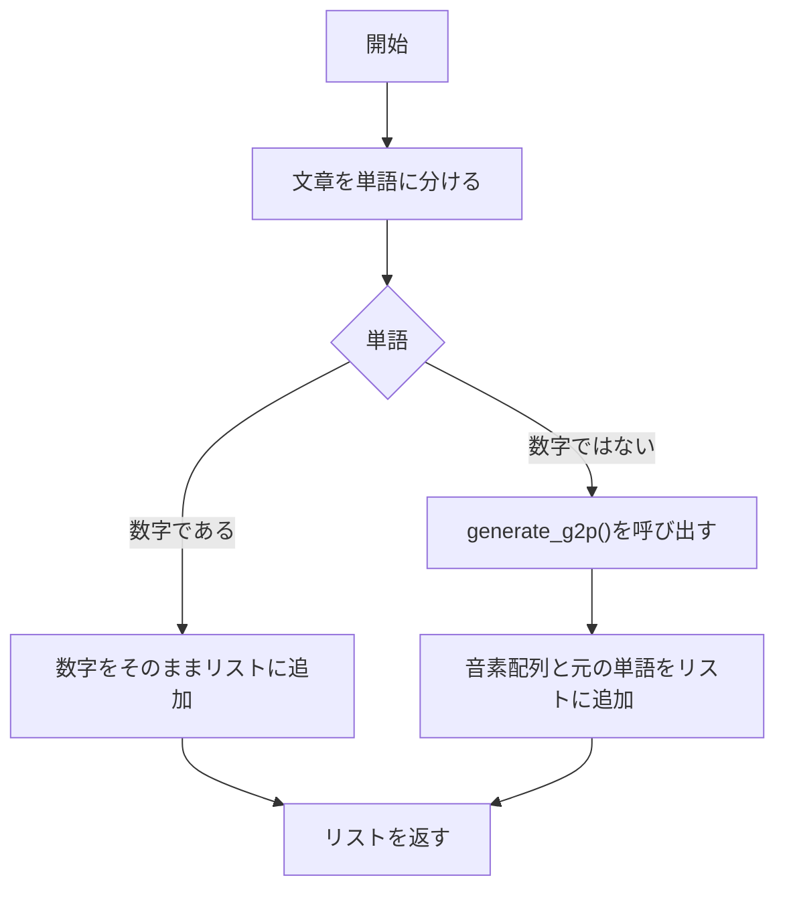
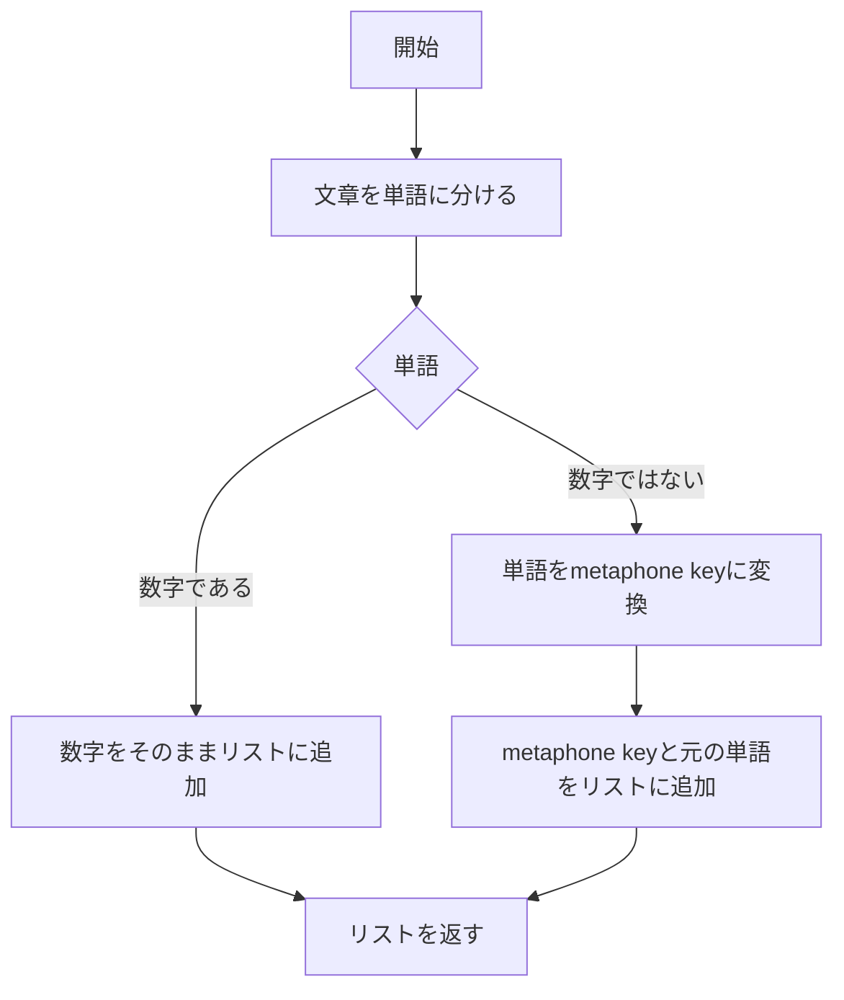
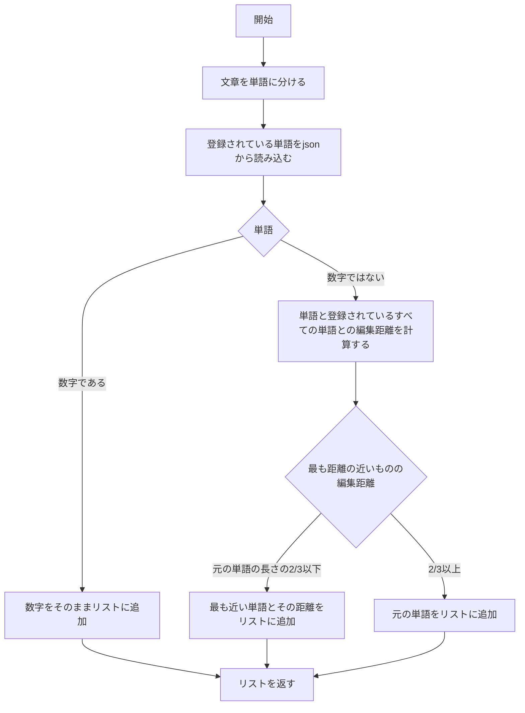
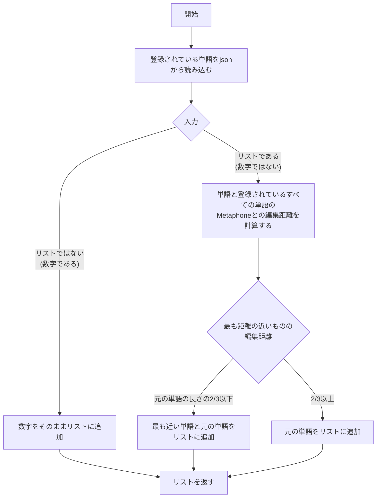

# Flight Number Extraction
音声認識を用いて文字起こしした航空管制官の命令文から航空機のコールサインに当たる部分を抽出するプログラムです。
現在はコールサインの抽出に特化しており、拡張性に乏しいですが、命令等の抽出にも応用できると期待しています。

# 目次
- [Flight Number Extraction](#flight-number-extraction)
- [目次](#目次)
- [プロジェクト概要](#プロジェクト概要)
  - [使用している外部ライブラリ](#使用している外部ライブラリ)
- [処理の説明](#処理の説明)
  - [処理の流れ](#処理の流れ)
  - [Levenshitein距離計算](#levenshitein距離計算)
    - [アルゴリズム](#アルゴリズム)
    - [例](#例)
  - [Metaphone](#metaphone)
  - [g2p](#g2p)
    - [g2p アルゴリズムの流れ](#g2p-アルゴリズムの流れ)
- [各関数について](#各関数について)
  - [sentense\_format.py](#sentense_formatpy)
    - [insert\_space\_befor\_number()](#insert_space_befor_number)
    - [extract\_number()](#extract_number)
    - [format\_sentence()](#format_sentence)
    - [word\_combination\_formatter()](#word_combination_formatter)
  - [g2p.py](#g2ppy)
    - [generate\_g2p()](#generate_g2p)
    - [generate\_g2p\_list()](#generate_g2p_list)
  - [metaphone.py](#metaphonepy)
    - [generate\_metaphone\_key\_list()](#generate_metaphone_key_list)
  - [word\_processing.py](#word_processingpy)
    - [replace\_words\_spell()](#replace_words_spell)
    - [replace\_words\_metaphone()](#replace_words_metaphone)
    - [replace\_words\_g2p()](#replace_words_g2p)
    - [extract\_callsigns()](#extract_callsigns)
    - [get\_closest\_callsign()](#get_closest_callsign)


# プロジェクト概要

このプロジェクトでは、`./registered_json` ディレクトリ内の `airline_code_dict.json` と `word_register.json` の2つのJSONファイルにコールサインを追加します。`airline_code_dict.json` では、コールサインは [callsign: 3レターコード] の形式で辞書として追加されます。`word_register.json` では、コールサインが複数の単語から構成される場合にも個別に追加されます（例: "all nippon", "all", "nippon"）。

JSONファイルを更新した後は、ターミナルで以下のコマンドを実行して、`requirements.txt` に記載されている依存関係をインストールする必要があります:

```bash
pip install -r requirements.txt
```
次に、registered_word_utils.py を実行して、registered_json ディレクトリに登録された情報から g2p および metaphone の辞書を生成します。生成された辞書は ./generated_json ディレクトリに保存されます。
```bash
python registered_word_utils.py
```

`main.py`の`main()`に文字起こしの結果の文章を渡して実行するとコールサインが抽出できた場合はコールサインが配列で、
できなかった場合には"Callsign not Found"と出力されます。


## 使用している外部ライブラリ
このプロジェクトでは、以下のライブラリとモジュールが使用されます:

- `json`: JSON ファイルの読み書きに使用されます。
- `doublemetaphone`: ダブルメタフォン（Double Metaphone）アルゴリズムを実装するライブラリです。
- `re`: 正規表現操作に使用されます。
- `G2p`: 英語の音素表現（Grapheme-to-Phoneme）変換を行うライブラリです。
- `Levenshtein.distance`: Levenshtein距離を計算するためのメソッドです。

これらのライブラリとモジュールは、プロジェクト内でテキストの処理、音素変換、および文字列の比較などのタスクに使用されます。

# 処理の説明

## 処理の流れ

1. 音声認識を用いて文字起こしした航空管制官の命令のテキストを受け取る
2. ハイフンやピリオド、コンマなどの不要部分を取り除く
    1. テキストと数字が連続している場合にはスペースを開ける
    2. 数字同士が連続している場合には間のスペースを取り除く
3. スペルをもとに登録されているコールサインとの編集距離計算を行い、便名の抽出を試みる
4. 抽出できれば結果を返す
5. 整形済み文章から単語ごとにmetaphoneとg2pのリストをそれぞれ作成
6. 登録されているコールサインをもとに作成した辞書とそれぞれ編集距離を計算し、便名の抽出を試みる
7. 抽出できれば結果を返す
8. 整形済みの文章を一つ飛ばしで接続し、奇数始まりの配列と、偶数始まりの配列の2つ生成し、それぞれでmetaphoneとg2pの編集距離計算を行います
9. 抽出したコールサインのうち、空域情報と照会した結果最も距離が近いものを結果として返します
10. ここまでで便名を抽出できなかった場合、見つけられなかったとエラーを返す。



## Levenshitein距離計算

Levenshtein距離は、2つの文字列間の類似度を測定するための一般的な手法です。この距離は、一方の文字列をもう一方の文字列に変換するために必要な最小の編集操作数を表します。

編集操作には、挿入、削除、置換の3種類が含まれます。Levenshtein距離は、これらの操作を用いて1つの文字列を別の文字列に変換する際の最小の操作数を計算します。

### アルゴリズム
Levenshtein距離を計算するアルゴリズムは、動的計画法を使用しています。以下は、Levenshtein距離を計算するアルゴリズムの基本的な手順です：
1. `初期化`: 2つの文字列の長さを取得し、それぞれの文字列の長さ+1のサイズを持つ行列を作成します。行列の各要素は、部分文字列間の距離を表します。
2. `初期値の設定`: 最初の行と最初の列を0からNに設定します。ここでNはそれぞれの文字列の長さです。
3. `部分問題の計算`: 行列の各セルに対して、以下の手順で部分問題を解決します。
    - 挿入、削除、置換の操作を考慮し、セルの左、上、左上の値から最小の値を選択します。
    - もし両方の文字が異なる場合、置換操作を行い、左上の値に1を加えます。同じ場合は追加の操作は不要です。
    - 選択された値を現在のセルに設定します。
4. `Levenshtein距離の取得`: 最後の行、最後の列の値が計算されたLevenshtein距離です。これが2つの文字列の間の最小編集操作数です。


### 例
以下は、2つの文字列 "kitten" と "sitting" のLevenshtein距離を計算する例です。

1. 初期化

|     |   | s | i | t | t | i | n | g |
|:--: |---|---|---|---|---|---|---|---|
|     | 0 | 1 | 2 | 3 | 4 | 5 | 6 | 7 |
|**k**| 1 |   |   |   |   |   |   |   |
|**i**| 2 |   |   |   |   |   |   |   |
|**t**| 3 |   |   |   |   |   |   |   |
|**t**| 4 |   |   |   |   |   |   |   |
|**e**| 5 |   |   |   |   |   |   |   |
|**n**| 6 |   |   |   |   |   |   |   |

2. 部分問題の計算:
    Levenshtein距離の計算における部分問題の計算は、動的計画法を使用しています。具体的な例として、2つの文字列 "kitten" と "sitting" を使用して説明します。
    各セルの計算は、以下のような手順で行われます:

    1. `左上のセル (置換)`:
        - 左上のセルは、現在のセルの左上に位置するセルです。このセルは、2つの部分文字列の最後の文字が同じである場合、置換操作を行う必要はありません。
        - 例えば、"kit" と "sit" の場合、"t" と "t" は同じなので、置換操作は不要です。したがって、左上のセルの値には置換操作による編集距離が加算されません。そのため、左上のセルの値は現在のセルと同じになります。
    2. `上のセル (挿入)`:
        - 上のセルは、現在のセルの上に位置するセルであり、現在のセルに文字を挿入する操作を示します。
        - 例えば、"kit" と "sitt" の場合、"sitt" に "e" を挿入して "sitte" を作成する必要があります。この操作は、編集距離に1を追加します。したがって、上のセルの値に1が加算されます。
    3. `左のセル (削除)`:
        - 左のセルは、現在のセルの左側に位置するセルであり、現在のセルから文字を削除する操作を示します。
        - 例えば、"kit" と "sitt" の場合、"kitt" から "k" を削除して "itt" を作成する必要があります。この操作は、編集距離に1を追加します。したがって、左のセルの値に1が加算されます。
    4. `選択された値 (最小値)`:
        - 上記の手順で計算された値の中から、最小の値が選択されます。これは、現在のセルの値として採用されます。
        - 例えば、左上のセルの値が0、上のセルの値が2、左のセルの値が3の場合、最小値は0です。したがって、現在のセルの値は0となります。

3. 計算後の行列

|     |   | s | i | t | t | i | n | g |
|:--: |---|---|---|---|---|---|---|---|
|     | 0 | 1 | 2 | 3 | 4 | 5 | 6 | 7 |
|**k**| 1 | 1 | 2 | 3 | 4 | 5 | 6 | 7 |
|**i**| 2 | 2 | 1 | 2 | 3 | 4 | 5 | 6 |
|**t**| 3 | 3 | 2 | 1 | 2 | 3 | 4 | 5 |
|**t**| 4 | 4 | 3 | 2 | 1 | 2 | 3 | 4 |
|**e**| 5 | 5 | 4 | 3 | 2 | 2 | 3 | 4 |
|**n**| 6 | 6 | 5 | 4 | 3 | 3 | 2 | 3 |

4. Levenshtein距離の取得: 行列の最後の値は 3 です。これが "kitten" から "sitting" へのLevenshtein距離です。

```python Levenshtein.py
def levenshtein_distance(s1, s2):
    """
    2つの文字列s1とs2の間のLevenshtein距離を計算する関数。

    Parameters
    ---
        s1: str
            比較する文字列の1つ目
        s2: str
            比較する文字列の2つ目

    Returns
    ---
        distance: int
            s1とs2の間のLevenshtein距離
    """
    # 行列の初期化
    rows = len(s1) + 1
    cols = len(s2) + 1
    matrix = [[0] * cols for _ in range(rows)]

    # 初期化
    for i in range(rows):
        matrix[i][0] = i
    for j in range(cols):
        matrix[0][j] = j

    # Levenshtein距離の計算
    for i in range(1, rows):
        for j in range(1, cols):
            cost = 0 if s1[i - 1] == s2[j - 1] else 1
            matrix[i][j] = min(matrix[i - 1][j] + 1,       # 挿入
                               matrix[i][j - 1] + 1,       # 削除
                               matrix[i - 1][j - 1] + cost)  # 置換

    # マトリックスの右下の値がLevenshtein距離
    return matrix[-1][-1]
```

## Metaphone
メタフォンは、単語の英語発音をインデックスするための音声符号化アルゴリズムです。単語の綴りではなく、音に基づいて単語を比較するために、発音の文字的表現を生成するように設計されています。スペル修正、検索、インデックス作成などのタスクで特に役立ちます。
綴りが違うものでも発音が同じであれば同じキーを共有するという特徴があります。

メタフォン アルゴリズムは、1990 年にローレンス・フィリップスによって開発され、以前のSoundex アルゴリズムの改良版です。Metaphoneは、英語の発音パターンを考慮し、Soundexよりも広範な音声のバリエーションを処理します。

単語入力からMetaphone Keyを生成するには、通常、以下のような手順に従います。

1. `単語の準備`: 単語を大文字に変換し、句読点や空白などの非アルファベット文字をすべて削除します。これにより、入力を標準化します。
2. `発音規則の適用`: Metaphoneは、単語の発音をその音声表現にマップするための規則セットに従います。これらの規則は、英語の発音パターンと一般的な音声変換を考慮に入れています。
3. `エンコード規則の適用`: 発音規則に基づいて、特定の文字または文字の組み合わせが特定の音声表現にエンコードされます。たとえば、「X」は「KS」、 「PH」は「F」、 「GN」は「N」などにエンコードされる可能性があります。
4. `特殊ケースの処理`: メタフォンは、英語発音における特定の特殊ケースと例外も考慮に入れます。たとえば、黙字は無視される可能性があり、特定の文字の組み合わせは、単語内でのコンテキストに応じて異なるようにエンコードされる可能性があります。
5. `キーの長さの制限`: 生成されるMetaphone Keyは、通常、異なる単語間の整合性と比較可能性を確保するために一定の長さに制限されます。これにより、効率的なインデックス作成と検索が支援されます。
6. `Metaphone Keyの出力`: 最終出力は、Metaphone アルゴリズムに従った単語の音声表現です。このキーは、ファジーマッチング、検索、インデックス作成など、スペルではなく発音に基づいたさまざまな目的で使用できます。
   
Metaphoneは音声インデックス作成のための強力なツールですが、発音のすべての微妙なニュアンスを捕捉できない場合がある。
異なる単語であっても、発音が同じであれば同じキーを共有する。
さらに、このアルゴリズムは主に英語の単語向けに設計されており、他の言語の単語にはそれほど効果的でない可能性があります。

## g2p
`g2p`は「grapheme-to-phoneme (グラフェーム-to-フォネーム)」変換の略称。これは、書記素 (グラフェーム) を対応する音素 (フォネーム) に変換することを意味している。
本来は文章を機械音声で読み上げさせるために利用することが目的らしい？

### g2p アルゴリズムの流れ

1. `入力`: 入力として、文章を受け取る。

2. `解析`: 入力単語を個々の書記素 (文字、アクセント記号、その他の文字を含む) に解析しする。

3. `音声辞書参照`: 各書記素または連続している書記素を、発音辞書またはレキシコンと参照する。この辞書は、書記素を対応する音素にマッピングする。

4. `規則とパターン`: 書記素と音素のマッピングが単純でない場合は、アルゴリズムは、発音を予測するために、言語規則、パターン、または統計モデルを適用することもある。これらの規則とパターンは、言語知識、言語の発音規則、または大量のテキスト コーパスの統計分析に基づいて作成される。

5. `出力`: 入力単語の発音を表す一連の音素が出力される。これらの音素は、音声合成システムによって対応する音声波形を生成するために使用することも可能。

g2p アルゴリズムは、処理する言語、発音辞書の品質、使用する言語規則とモデルの洗練度などに応じて、複雑さと精度が異なる。


# 各関数について
## sentense_format.py
### insert_space_befor_number()
単語内に数字が登場する場合、初めて数字が出現したとき、その前に半角スペースを挿入する関数


### extract_number()
引数として与えられた文字列から数字から始まる場合、数字だけを取り出す


### format_sentence()
音声文字起こしを行った生の文章のフォーマットを行う関数


### word_combination_formatter()
普通の文で便名抽出に失敗した場合に呼び出される


## g2p.py
### generate_g2p()
単語を引数として、それに対応するg2pを返す。
g2pはデフォルトでは音素の配列を返すため、それを繋げて単語全体として返す。

### generate_g2p_list()
整形済みの文章を引数とし、単語ごとにg2pに変換し、リストを返す。


## metaphone.py
### generate_metaphone_key_list()
整形済みの文章を引数とし、単語ごとにmetaphone keyに変換し、リストを返す。


## word_processing.py
単語を編集距離をもとに変換する
### replace_words_spell()
与えられた整形済みの文章を単語ごとに区切り、スペルを元に距離を計算し、登録されている近い単語に置き換える。


### replace_words_metaphone()
与えられた単語のmetaphone keyの配列に対して、./generated_json/word_metaphone_key.jsonに登録されている単語との距離を計算し、最も近い単語に置き換える。


### replace_words_g2p()
与えられた単語のg2pの配列に対して、./generated_json/word_g2p_key.jsonに登録されている単語との距離を計算し、最も近い単語に置き換える。


### extract_callsigns()


### get_closest_callsign()

