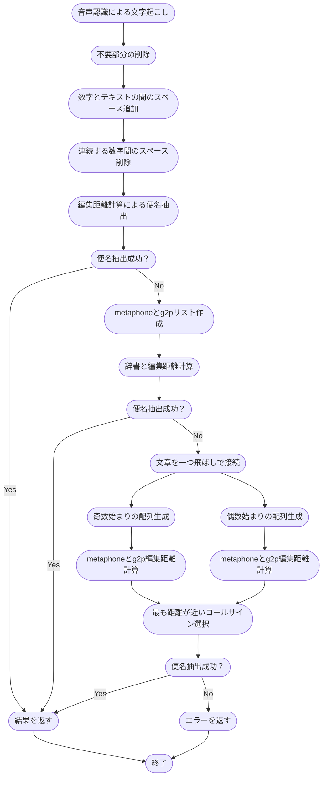
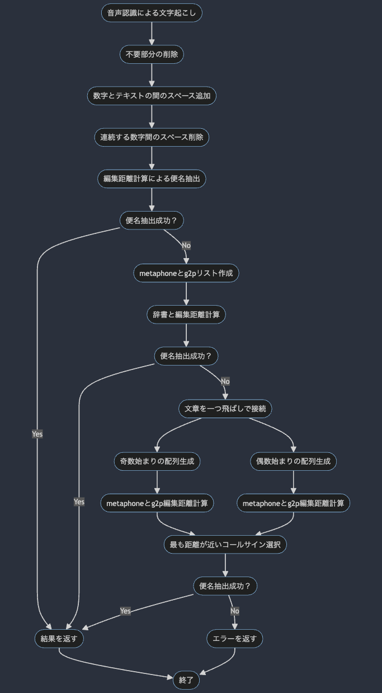

# Flight Number Extraction
音声認識を用いて文字起こしした航空管制官の命令文から航空機のコールサインに当たる部分を抽出するプログラムです。
現在はコールサインの抽出に特化しており、拡張性に乏しいですが、命令等の抽出にも応用できると期待しています。

# 目次
- [Flight Number Extraction](#flight-number-extraction)
- [目次](#目次)
- [プロジェクト概要](#プロジェクト概要)
  - [Project Description](#project-description)
  - [使用している外部ライブラリ](#使用している外部ライブラリ)
  - [External Libraries Used](#external-libraries-used)
- [処理の説明](#処理の説明)
  - [処理の流れ](#処理の流れ)
  - [Levenshitein距離計算](#levenshitein距離計算)
    - [アルゴリズム](#アルゴリズム)
    - [例](#例)


# プロジェクト概要

このプロジェクトでは、`./registered_json` ディレクトリ内の `airline_code_dict.json` と `word_register.json` の2つのJSONファイルにコールサインを追加します。`airline_code_dict.json` では、コールサインは [callsign: 3レターコード] の形式で辞書として追加されます。`word_register.json` では、コールサインが複数の単語から構成される場合にも個別に追加されます（例: "all nippon", "all", "nippon"）。

JSONファイルを更新した後は、ターミナルで以下のコマンドを実行して、`requirements.txt` に記載されている依存関係をインストールする必要があります:

```bash
pip install -r requirements.txt
```
次に、registered_word_utils.py を実行して、registered_json ディレクトリに登録された情報から g2p および metaphone の辞書を生成します。生成された辞書は ./generated_json ディレクトリに保存されます。
```bash
python registered_word_utils.py
```

`main.py`の`main()`に文字起こしの結果の文章を渡して実行するとコールサインが抽出できた場合はコールサインが配列で、
できなかった場合には"Callsign not Found"と出力されます。


## Project Description
This project involves adding call signs to two JSON files, `airline_code_dict.json` and `word_register.json`, located in the `./registered_json` directory. In `airline_code_dict.json`, call signs are added in the format [callsign: 3-letter code] as a dictionary. In `word_register.json`, call signs are added individually, considering cases where a call sign consists of multiple words (e.g., "all nippon", "all", "nippon").

After updating the JSON files, you need to install the dependencies listed in `requirements.txt` by executing the following command in the terminal:

```bash
pip install -r requirements.txt
```
Next, you should run `registered_word_utils.py` to generate dictionaries for `g2p` and `metaphone` from the registered information in the `registered_json` directory. The generated dictionaries will be saved in the `./generated_json` directory.

```bash
python registered_word_utils.py
```
In `main.py`, the `main()` function accepts a transcribed text result as input. If call signs are found, they will be returned as an array. If no call signs are found, the output will be "Callsign not Found".

## 使用している外部ライブラリ
このプロジェクトでは、以下のライブラリとモジュールが使用されます:

- `json`: JSON ファイルの読み書きに使用されます。
- `doublemetaphone`: ダブルメタフォン（Double Metaphone）アルゴリズムを実装するライブラリです。
- `re`: 正規表現操作に使用されます。
- `G2p`: 英語の音素表現（Grapheme-to-Phoneme）変換を行うライブラリです。
- `Levenshtein.distance`: Levenshtein距離を計算するためのメソッドです。

これらのライブラリとモジュールは、プロジェクト内でテキストの処理、音素変換、および文字列の比較などのタスクに使用されます。


## External Libraries Used
This project utilizes the following libraries and modules:

- `json`: Used for reading and writing JSON files.
- `doublemetaphone`: A library implementing the Double Metaphone algorithm.
- `re`: Utilized for regular expression operations.
- `G2p`: A library for Grapheme-to-Phoneme conversion in English.
- `Levenshtein.distance`: Method for calculating Levenshtein distance.

These libraries and modules are used for tasks such as text processing, phonetic conversion, and string comparison within the project.


# 処理の説明

## 処理の流れ

音声認識を用いて文字起こしした航空管制官の命令のテキストを受け取る
↓
ハイフンやピリオド、コンマなどの不要部分を取り除く。
テキストと数字が連続している場合にはスペースを開ける。
数字同士が連続している場合には間のスペースを取り除く。
↓
スペルをもとに登録されているコールサインとの編集距離計算を行い、便名の抽出を試みる。→抽出できれば結果を返す
↓
整形済み文章から単語ごとにmetaphoneとg2pのリストをそれぞれ作成。
↓
登録されているコールサインをもとに作成した辞書とそれぞれ編集距離を計算し、便名の抽出を試みる。→抽出できれば結果を返す
↓
整形済みの文章を一つ飛ばしで接続し、奇数始まりの配列と、偶数始まりの配列の2つ生成し、それぞれでmetaphoneとg2pの編集距離計算を行います。
抽出したコールサインのうち、空域情報と照会した結果最も距離が近いものを結果として返します。
↓
ここまでで便名を抽出できなかった場合、見つけられなかったとエラーを返す。




## Levenshitein距離計算

Levenshtein距離は、2つの文字列間の類似度を測定するための一般的な手法です。この距離は、一方の文字列をもう一方の文字列に変換するために必要な最小の編集操作数を表します。

編集操作には、挿入、削除、置換の3種類が含まれます。Levenshtein距離は、これらの操作を用いて1つの文字列を別の文字列に変換する際の最小の操作数を計算します。

### アルゴリズム
Levenshtein距離を計算するアルゴリズムは、動的計画法を使用しています。以下は、Levenshtein距離を計算するアルゴリズムの基本的な手順です：
1. `初期化`: 2つの文字列の長さを取得し、それぞれの文字列の長さ+1のサイズを持つ行列を作成します。行列の各要素は、部分文字列間の距離を表します。
2. `初期値の設定`: 最初の行と最初の列を0からNに設定します。ここでNはそれぞれの文字列の長さです。
3. `部分問題の計算`: 行列の各セルに対して、以下の手順で部分問題を解決します。
    - 挿入、削除、置換の操作を考慮し、セルの左、上、左上の値から最小の値を選択します。
    - もし両方の文字が異なる場合、置換操作を行い、左上の値に1を加えます。同じ場合は追加の操作は不要です。
    - 選択された値を現在のセルに設定します。
4. `Levenshtein距離の取得`: 最後の行、最後の列の値が計算されたLevenshtein距離です。これが2つの文字列の間の最小編集操作数です。


### 例
以下は、2つの文字列 "kitten" と "sitting" のLevenshtein距離を計算する例です。

1. 初期化

|     |   | s | i | t | t | i | n | g |
|:--: |---|---|---|---|---|---|---|---|
|     | 0 | 1 | 2 | 3 | 4 | 5 | 6 | 7 |
|**k**| 1 |   |   |   |   |   |   |   |
|**i**| 2 |   |   |   |   |   |   |   |
|**t**| 3 |   |   |   |   |   |   |   |
|**t**| 4 |   |   |   |   |   |   |   |
|**e**| 5 |   |   |   |   |   |   |   |
|**n**| 6 |   |   |   |   |   |   |   |

2. 部分問題の計算:
    Levenshtein距離の計算における部分問題の計算は、動的計画法を使用しています。具体的な例として、2つの文字列 "kitten" と "sitting" を使用して説明します。
    各セルの計算は、以下のような手順で行われます:

    1. `左上のセル (置換)`:
        - 左上のセルは、現在のセルの左上に位置するセルです。このセルは、2つの部分文字列の最後の文字が同じである場合、置換操作を行う必要はありません。
        - 例えば、"kit" と "sit" の場合、"t" と "t" は同じなので、置換操作は不要です。したがって、左上のセルの値には置換操作による編集距離が加算されません。そのため、左上のセルの値は現在のセルと同じになります。
    2. `上のセル (挿入)`:
        - 上のセルは、現在のセルの上に位置するセルであり、現在のセルに文字を挿入する操作を示します。
        - 例えば、"kit" と "sitt" の場合、"sitt" に "e" を挿入して "sitte" を作成する必要があります。この操作は、編集距離に1を追加します。したがって、上のセルの値に1が加算されます。
    3. `左のセル (削除)`:
        - 左のセルは、現在のセルの左側に位置するセルであり、現在のセルから文字を削除する操作を示します。
        - 例えば、"kit" と "sitt" の場合、"kitt" から "k" を削除して "itt" を作成する必要があります。この操作は、編集距離に1を追加します。したがって、左のセルの値に1が加算されます。
    4. `選択された値 (最小値)`:
        - 上記の手順で計算された値の中から、最小の値が選択されます。これは、現在のセルの値として採用されます。
        - 例えば、左上のセルの値が0、上のセルの値が2、左のセルの値が3の場合、最小値は0です。したがって、現在のセルの値は0となります。

3. 計算後の行列

|     |   | s | i | t | t | i | n | g |
|:--: |---|---|---|---|---|---|---|---|
|     | 0 | 1 | 2 | 3 | 4 | 5 | 6 | 7 |
|**k**| 1 | 1 | 2 | 3 | 4 | 5 | 6 | 7 |
|**i**| 2 | 2 | 1 | 2 | 3 | 4 | 5 | 6 |
|**t**| 3 | 3 | 2 | 1 | 2 | 3 | 4 | 5 |
|**t**| 4 | 4 | 3 | 2 | 1 | 2 | 3 | 4 |
|**e**| 5 | 5 | 4 | 3 | 2 | 2 | 3 | 4 |
|**n**| 6 | 6 | 5 | 4 | 3 | 3 | 2 | 3 |

4. Levenshtein距離の取得: 行列の最後の値は 3 です。これが "kitten" から "sitting" へのLevenshtein距離です。

```python Levenshtein.py
def levenshtein_distance(s1, s2):
    """
    2つの文字列s1とs2の間のLevenshtein距離を計算する関数。

    Parameters
    ---
        s1: str
            比較する文字列の1つ目
        s2: str
            比較する文字列の2つ目

    Returns
    ---
        distance: int
            s1とs2の間のLevenshtein距離
    """
    # 行列の初期化
    rows = len(s1) + 1
    cols = len(s2) + 1
    matrix = [[0] * cols for _ in range(rows)]

    # 初期化
    for i in range(rows):
        matrix[i][0] = i
    for j in range(cols):
        matrix[0][j] = j

    # Levenshtein距離の計算
    for i in range(1, rows):
        for j in range(1, cols):
            cost = 0 if s1[i - 1] == s2[j - 1] else 1
            matrix[i][j] = min(matrix[i - 1][j] + 1,       # 挿入
                               matrix[i][j - 1] + 1,       # 削除
                               matrix[i - 1][j - 1] + cost)  # 置換

    # マトリックスの右下の値がLevenshtein距離
    return matrix[-1][-1]
```


